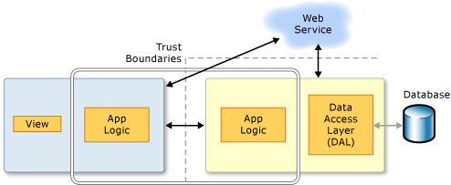

---
title: Open Ria Services
TOCTitle: Open Ria Services
ms:assetid: 3e32ac52-9d4f-4a5e-9a98-05cc0348bf17
ms:mtpsurl: https://msdn.microsoft.com/en-us/library/Ee707344(v=VS.91)
ms:contentKeyID: 27195652
ms.date: 08/19/2013
mtps_version: v=VS.91
---

# Open Ria Services

\[ **This document was written for WCF Services Version 1 Service Pack 2 and might not be up to date**  
Please see [Release Notes](https://github.com/OpenRIAServices/OpenRiaServices/releases) or [Changelog](https://github.com/OpenRIAServices/OpenRiaServices/blob/main/Changelog.md) for a list of changes since WCF RIA Services \]

Open Ria Services simplifies the development of n-tier solutions for Rich Internet Applications (RIA), such as Silverlight applications. A common problem when developing an n-tier RIA solution is coordinating application logic between the middle tier and the presentation tier. To create the best user experience, you want your Open Ria Services client to be aware of the application logic that resides on the server, but you do not want to develop and maintain the application logic on both the presentation tier and the middle tier. Open Ria Services solves this problem by providing framework components, tools, and services that make the application logic on the server available to the Open Ria Services client without requiring you to manually duplicate that programming logic. You can create a Open Ria Services client that is aware of business rules and know that the client is automatically updated with latest middle tier logic every time that the solution is re-compiled.

The following illustration shows a simplified version of an n-tier application. Open Ria Services focuses on the box between the presentation tier and the data access layer (DAL) to facilitate n-tier development with a Open Ria Services client.

Open Ria Services adds tools to Visual Studio that enable linking client and server projects in a single solution and generating code for the client project from the middle-tier code. The framework components support prescriptive patterns for writing application logic so that it can be reused on the presentation tier. Services for common scenarios, such as authentication and user settings management, are provided to reduce development time.

## WCF Integration

In Open Ria Services, you expose data from the server project to client project by adding domain services. The Open Ria Services framework implements each domain service as a Windows Communication Foundation (WCF) service. Therefore, you can apply the concepts you know from WCF services to domain services when customizing the configuration. For more information, see [Domain Services](ee707373.md).

## Securing a Open Ria Services Solution

To ensure that your application addresses the security concerns associated with exposing a domain service, you must carefully consider how you implement the domain service. For more information, see [Building Secure Applications with Open Ria Services](ff626373.md).

## Tools and Documentation

The Open Ria Services documentation require several prerequisite programs, such as Visual Studio and the Silverlight Developer Runtime and SDK, be installed and configured properly, in addition to Open Ria Services and the Open Ria Services Toolkit to work thorough the walkthroughs and how-to topics. They also require installing and configuring SQL Server 2008 R2 Express with Advanced Services and installing the AdventureWorks OLTP and LT database.

Detailed instructions for the satisfaction of each of these prerequisites are provided by the topics within the [Prerequisites for Open Ria Services](gg512106.md) node. Follow the instructions provided there before proceeding with this walkthrough to ensure that you encounter as few problems as possible when working through this Open Ria Services walkthroughs.

## Topics

[Prerequisites for Open Ria Services](gg512106.md)

  - [Walkthrough: Installing and Configuring SQL Server 2008 R2 Express with Advanced Services](gg512108.md)

  - [Walkthrough: Installing the AdventureWorks OLTP and LT sample databases](gg512107.md)

[Creating Open Ria Services Solutions](ee707336.md)

  - [Walkthrough: Taking a Tour of Open Ria Services](ff713719.md)

  - [Walkthrough: Creating a Open Ria Services Solution](ee707376.md)

  - [Walkthrough: Creating a Open Ria Service with the Code First Approach](hh556025.md)

  - [Walkthrough: Using the Silverlight Business Application Template](ee707360.md)

  - [Walkthrough: Creating a Open Ria Services Class Library](ee707351.md)

  - [Walkthrough: Localizing a Business Application](ff679940.md)

  - [How to: Create a Domain Service that uses POCO-defined Entities](gg602754.md)

  - [How to: Add or Remove a Open Ria Services Link](ee707372.md)

  - [Using the Domain Service Wizard](gg153664.md)

[Building Secure Applications with Open Ria Services](ff626373.md)

[Deploying and Localizing a Open Ria Services Solutions](ff679939.md)

  - [Troubleshooting the Deployment of a Open Ria Services Solution](ff426913.md)

  - [Troubleshooting the Deployment of a Open Ria Services Solution](ff426913.md)

  - [Walkthrough: Localizing a Business Application](ff679940.md)

[Middle Tier](ee707348.md)

  - [Domain Services](ee707373.md)
    
      - [Walkthrough: Adding Query Methods](ee707362.md)
    
      - [How to: Add Business Logic to the Domain Service](ee796240.md)
    
      - [How to: Create a Domain Service that uses POCO-defined Entities](gg602754.md)
    
      - [How to: Use HTTPS with a Domain Service](ee707342.md)

  - [Data](ee707356.md)
    
      - [Compositional Hierarchies](ee707346.md)
    
      - [Presentation Models](ee707347.md)
    
      - [Inheritance in Data Models](ee707366.md)
    
      - [Complex Types](gg602753.md)
    
      - [Shared Entities](gg602750.md)
    
      - [Walkthrough: Sharing Entities between Multiple Domain Services](ff422034.md)
    
      - [How to: Add Metadata Classes](ee707339.md)
    
      - [How to: Validate Data](ee707335.md)
    
      - [Managing Data Concurrency](gg602751.md)
    
      - 1.  [How to: Enable Optimistic Concurrency Checks](gg602748.md)
        
        2.  [How to: Add Explicit Transactions to a Domain Service](ee707364.md)

  - [Shared Code](ee707371.md)
    
      - [How to: Share Code through Source Files](ee707369.md)
    
      - [Walkthrough: Creating a Open Ria Services Class Library](ee707351.md)

[Silverlight Clients](ee707349.md)

  - [Client Code Generation](ee707359.md)

  - [DomainContext and Operations](ee707370.md)

  - [DomainDataSource](ee707363.md)

  - [Error Handling on the Client](ee807307.md)

  - [Customizing Generated Code](ee707345.md)
    
      - [How to: Add Computed Properties on the Client](ee707331.md)

[Accessing non-Silverlight Clients](gg602749.md)

  - [ASP.NET Clients](ee707352.md)

  - [Walkthrough: Using the Domain Service in ASP.NET Applications](ee807305.md)

[Authentication, Roles, and Profiles](ee707361.md)

  - [How to: Enable Authentication in Open Ria Services](ee707353.md)

  - [How to: Enable Roles in Open Ria Services](ee707375.md)

  - [How to: Enable Profiles in Open Ria Services](ee707350.md)

  - [How to: Create a Custom Authorization Attribute](ee707357.md)

  - [Walkthrough: Using Authentication Service with Silverlight Business Application](ee942449.md)

  - [Walkthrough: Using Authentication Service with Silverlight Navigation Application](ee942451.md)

[End-to-EndScenarios](gg602747.md)

  - [Walkthrough: Retrieving and Displaying Data From a Domain Service](ee707367.md)

  - [Walkthrough: Editing Data From a Domain Service](ee707338.md)

  - [Walkthrough: Displaying Data in a Silverlight Business Application](ee796239.md)

  - [Walkthrough: Displaying Related Data in a Silverlight Business Application](ee796241.md)

## See Also

#### Other Resources

[Offline Open Ria Services documentation](http://go.microsoft.com/fwlink/?linkid=185200)

## .NET Documentation Archive

This documentation was originaly fetched from [.NET Documentation Archive](https://github.com/MicrosoftDocs/dotnet-archive)
The original work was open sourced and release by microsoft 
* [Issue](https://github.com/MicrosoftDocs/feedback/issues/1963)
* [Original PR](https://github.com/MicrosoftDocs/dotnet-archive/pull/1)

## License

The documentation and other content in this repository is licensed under the
[Creative Commons Attribution 4.0 International Public License](https://creativecommons.org/licenses/by/4.0/legalcode)
(see the [LICENSE](LICENSE) file), while any code in the repository is licensed
under the MIT License (see the [LICENSE-CODE](LICENSE-CODE) file).
