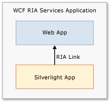
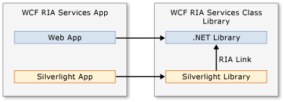
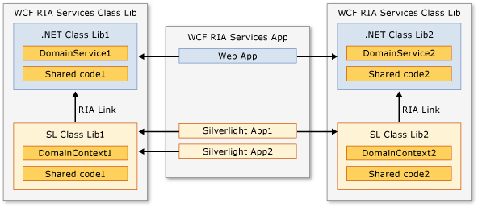

---
title: Creating Open Ria Services Solutions
TOCTitle: Creating Open Ria Services Solutions
ms:assetid: 20331d3a-0da3-4dbf-bc38-e51bcf1e9a9c
ms:mtpsurl: https://msdn.microsoft.com/en-us/library/Ee707336(v=VS.91)
ms:contentKeyID: 27195644
ms.date: 08/19/2013
mtps_version: v=VS.91
---

# Creating Open Ria Services Solutions

\[ **This document was written for WCF Services Version 1 Service Pack 2 and might not be up to date**  
Please see [Release Notes](https://github.com/OpenRIAServices/OpenRiaServices/releases) or [Changelog](https://github.com/OpenRIAServices/OpenRiaServices/blob/main/Changelog.md) for a list of changes since WCF RIA Services \]

Open Ria Services enables you to create solutions that address a variety of scenarios when creating business applications. These scenarios range from quite elementary to significantly complex. An elementary scenario might, for example, consist of a single Silverlight application that accesses only a few domain services in the middle tier. A more complex scenario could contain multiple Silverlight applications that are all linked to a common middle-tier layer that exposes a large set of domain services. This topic addresses issues that arise when creating and managing a Open Ria Services solution. It addresses questions such as the following:

  - What are the different ways of structuring a Open Ria Services solution?

  - Which structure is best for a particular scenario?

  - How can you troubleshoot a solution?

  - How can you deploy a solution?

This topic also provides some guidance to the Walkthroughs and other topics contained in this section that take you through tasks associated with a number of typical scenarios relevant to Open Ria Services. This section contains the following six Walkthroughs:

1.  [Walkthrough: Taking a Tour of Open Ria Services](ff713719.md)

2.  [Walkthrough: Creating a Open Ria Services Solution](ee707376.md)

3.  [Walkthrough: Creating a Open Ria Service with the Code First Approach](hh556025.md)

4.  [Walkthrough: Using the Silverlight Business Application Template](ee707360.md)

5.  [Walkthrough: Creating a Open Ria Services Class Library](ee707351.md)

6.  [Walkthrough: Localizing a Business Application](ff679940.md)

This section also contains the following three topics:

1.  [How to: Add or Remove a Open Ria Services Link](ee707372.md) on managing the Open Ria Services links.

2.  [Using the Domain Service Wizard](gg153664.md) documenting the UI elements in the dialog box.

3.  [Debugging a Open Ria Services Solution](https://msdn.microsoft.com/en-us/library/Gg602752) providing some guidance on what to do when things go wrong with creating a Open Ria Services solution.

The walkthroughs presented in this section of the Open Ria Services documentation require several prerequisite programs, such as Visual Studio and the Silverlight Runtime and SDK, be installed and configured properly, in addition to Open Ria Services and the Open Ria Services Toolkit. They also require installing and configuring SQL Server 2008 R2 Express with Advanced Services and installing the AdventureWorks OLTP and LT database.

Detailed instructions for the satisfaction of each of these prerequisites are provided by the topics within the [Prerequisites for Open Ria Services](gg512106.md) node. Follow the instructions provided there to ensure that you encounter as few problems as possible when working through this Open Ria Services walkthroughs in this section.

## Open Ria Services Link

In all Open Ria Services solutions, a link (known as a Open Ria Services link) exists between a Silverlight project and its associated middle-tier project. A Open Ria Services link is a special form of project-to-project reference that facilitates generating presentation-tier code from code in the middle tier. You create a Open Ria Services link by selecting the **Enable Open Ria Services** check box when you create a new Silverlight project. You can also create a Open Ria Services link for existing projects in the project properties. In some cases, you create the Open Ria Services link between application projects, and in other cases you create the link between class library projects, as described in the following sections.

When a link exists between the projects, the Silverlight project receives proxy classes that enable it to access the middle-tier code. There is no way to specify that only certain parts of the middle tier apply to a Silverlight project. The following rules apply to the use of Open Ria Services links:

  - The link is defined in a Silverlight client project.

  - The link always points from a Silverlight client project to a .NET server project or class library.

  - There can only be one link per Silverlight client project.

  - The link cannot point to other Silverlight client projects.

  - Multiple Silverlight client projects can point to the same server project or class library.

  - A Silverlight application cannot link directly to a class library project.

For more information on managing Open Ria Services links, see [How to: Add or Remove a Open Ria Services Link](ee707372.md) in this section.

## Default Solution Structure

In the default solution structure, Open Ria Services creates a single client project and a (single) server project. When you create a new project using the **Silverlight Application** template and check the **Enable Open Ria Services** box, a solution with this default structure gets created. A Open Ria Services link then already exists between the two projects. When you build the solution, client code is generated for domain services and shared code. The following illustration shows the default solution structure.

The default solution structure is convenient because all domain service types and shared code added to the server project are automatically available to the Silverlight client project after you build the solution. Also, the shared code you add to the server project is visible in the client project. This structure works well when you do not have many domain services in the server project and you do not need to reuse business logic across many different Silverlight applications.

In a solution with the default structure, you can add more Silverlight applications with a Open Ria Services link to the server project. However, there are limitations of the default structure. The generated code for each Silverlight client can access all of middle-tier code from the server project. For example, if you have three Silverlight applications linked to a single server project and you want to add a domain service that will be used by only one of the Silverlight applications, all three client applications will have a generated domain context for the domain service and will be able to access that domain service.

For more information on creating Open Ria Services solutions in Visual Studio, see [Walkthrough: Creating a Open Ria Services Solution](ee707376.md). For more information about the code generated for a client project, see [Client Code Generation](ee707359.md).

### Silverlight Business Application template

Open Ria Services also provides a **Silverlight Business Application** template. This template provides a convenient starting point for building a business application that utilizes Silverlight for the client. The template builds on the Silverlight Navigation Application and uses Open Ria Services to support authentication and user registration. When you create a project by using the **Silverlight Business Application** template, Open Ria Services creates the solution with the default structure. The **Silverlight Business Application** template automatically adds the following features:

  - Login window

  - Registration window

  - Silverlight Navigation

The default authentication mode for the Business Application is Forms Authentication. To use Windows Authentication, you simply change the value of the authentication element in the Web.config file, such as \<authentication mode="Windows"/\>, and change the value of the [Authentication](ff457819.md) property on the generated WebContext class. The Business Application template automatically contains code to support either FormsAuthentication or Windows Authentication. For more information, see the [Walkthrough: Using the Silverlight Business Application Template](ee707360.md) topic.

The Services folder of the server project contains the domain services that expose user registration and user authentication. The user registration service utilizes the ASP.NET membership provider to create new users. In the server project, a folder named Models contains classes for defining properties for user and registration data. You can add properties to these classes to customize the user data for your application.

In the client project, the Business Application contains code to simplify developing the presentation layer. The Libs folder and the Controls folder contain assemblies and controls that are used within the template. The Login folder (located within the Views folder) contains the authentication and user registration controls. These controls are automatically enabled in the project. The Resources folder (located in the Assets folder) contains resource strings for text within the project. As you add text to your application, you can add them to the file for application strings.

For more information, see [Walkthrough: Using the Silverlight Business Application Template](ee707360.md).

## Supporting N-tier Class Library Components

Open Ria Services provide the **Open Ria Services Class Library** project type to support sharing code through libraries. By using class libraries, you package business logic into reusable N-tier class library components.

The following illustration shows a solution structure that uses a Open Ria Services class library.

In the illustration, notice that a Open Ria Services link does not exist between the application projects. Instead, the link exists between the class library projects. You can use any number of the class libraries in your application, and you can reuse the class library in any number of applications.

Using Open Ria Services class libraries provides the following advantages:

  - The server and client portions of a single domain of data can be developed and packaged as a single component. This component can be reused in multiple applications.

  - Client proxy code generation and source code sharing occurs in only one location. The location is between the tiers of the component and not in every Silverlight application.

  - Multiple Silverlight applications within a single Web application project can refer to just the class libraries they need. A Silverlight client does not, in this way, have to see all the business logic exposed by the middle tier.

With Open Ria Services class libraries, you can build a flexible solution structure that provides only the components that are needed for an application. The following illustration shows a solution structure that uses multiple Open Ria Services class libraries.

> [!IMPORTANT]
> If you add a Class Library project to a <STRONG>Silverlight Business Application</STRONG> project, you cannot add an authentication service to the server project in the class library. The User object in the <STRONG>Silverlight Business Application</STRONG> template is inaccessible to the class library.

For more information, see [Walkthrough: Creating a Open Ria Services Class Library](ee707351.md).

