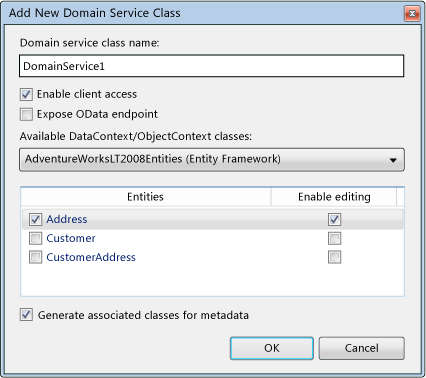

---
title: 'How to: Add Metadata Classes'
TOCTitle: 'How to: Add Metadata Classes'
ms:assetid: 32bedc2f-a758-4919-bd77-7265c5ad100d
ms:mtpsurl: https://msdn.microsoft.com/en-us/library/Ee707339(v=VS.91)
ms:contentKeyID: 27195647
ms.date: 08/19/2013
mtps_version: v=VS.91
dev_langs:
- vb
- csharp
---

# How to: Add Metadata Classes

\[ **This document was written for WCF Services Version 1 Service Pack 2 and might not be up to date** <br />
Please see [Release Notes](https://github.com/OpenRIAServices/OpenRiaServices/releases) or [Changelog](https://github.com/OpenRIAServices/OpenRiaServices/blob/main/Changelog.md) for a list of changes since WCF RIA Services \]

This topic explains how to use metadata to add functionality to your server and client side entities by decorating properties in a metadata class with attributes that you want to affect the behavior of your entities. Open Ria Services supports the ability to annotate entity classes and properties. Annotations are implemented with partial classes called metadata classes. You use metadata classes when you want to annotate the generated entity classes, but do not want to lose those annotations when the entity class is regenerated. This allows you to add functionality such as validation and child entity composition. You specify a metadata class by using the [MetadataTypeAttribute](https://msdn.microsoft.com/en-us/library/Cc679243) attribute.

There are two ways that you can add metadata classes. When you add a new [DomainService](ff422911.md) class with the **Add New Domain Service Class** wizard, you can specify that a metadata class be automatically generated by checking the **Generate associated classes for metadata**. You can also add a metadata class manually. This topic describes these two ways to add metadata classes.

### To add a metadata class by using the Domain Service Class template

1.  In the server project, add a new item and select the **Domain Service Class** template.

2.  When the **Add New Domain Service Class** dialog box appears, select the entities to expose in the domain service.

3.  Select the **Generate associated classes for metadata** check box.
    
    

4.  Click **OK**.
    
    A file for the domain service class is generated, and a file for the metadata class is generated. The metadata class contains .metadata in its name (such as, DomainService1.metadata.cs or DomainService1.metadata.vb).

5.  Open the metadata class and add attributes to the properties.
    
    The following example shows a metadata class with [RoundtripOriginalAttribute](ff423279.md), [RequiredAttribute](https://msdn.microsoft.com/en-us/library/Cc679203), [StringLengthAttribute](https://msdn.microsoft.com/en-us/library/Cc679251), and [ExcludeAttribute](ff422771.md) applied to some of the properties.
    
    ``` vb
    <MetadataTypeAttribute(GetType(Address.AddressMetadata))>  _
    Partial Public Class Address
    
        Friend NotInheritable Class AddressMetadata
    
            'Metadata classes are not meant to be instantiated.
            Private Sub New()
                MyBase.New
            End Sub
    
            Public AddressID As Integer
    
            <Required()> _
            <StringLength(60)> _
            Public AddressLine1 As String
    
            Public AddressLine2 As String
    
            <Required()> _
            <StringLength(30)> _
            Public City As String
    
            Public CountryRegion As String
    
            Public CustomerAddresses As EntityCollection(Of CustomerAddress)
    
            Public ModifiedDate As DateTime
    
            <Required()> _
            Public PostalCode As String
    
            <Exclude()> _
            Public rowguid As Guid
    
            Public StateProvince As String
        End Class
    End Class
    ```
    
    ``` csharp
    [MetadataTypeAttribute(typeof(Address.AddressMetadata))]
    public partial class Address
    {
    
        internal sealed class AddressMetadata
        {
            // Metadata classes are not meant to be instantiated.
            private AddressMetadata()
            {
            }
    
            public int AddressID;
    
            [Required]
            [StringLength(60)]
            public string AddressLine1;
    
            public string AddressLine2;
    
            [Required]
            [StringLength(30)]
            public string City;
    
            public string CountryRegion;
    
            public EntityCollection<CustomerAddress> CustomerAddresses;
    
            public DateTime ModifiedDate;
    
            [Required]
            public string PostalCode;
    
            [Exclude]
            public Guid rowguid;
    
            public string StateProvince;
        }
    }
    ```

### To add a metadata class manually

1.  In the server project, add a new class file with the same name as the entity class that you want to annotate. By convention, include .metadata in its file name.

2.  Add the partial keyword to make the class a partial class.
    
    The following example shows a partial class that matches an entity class named Address.
    
    ``` vb
    Partial Public Class Address
    End Class
    ```
    
    ``` csharp
    public partial class Address
    {
    }
    ```

3.  In the partial class, create an internal class that will serve as the metadata class.
    
    The following example shows the internal metadata class.
    
    ``` vb
    Partial Public Class Address
      Friend NotInheritable Class AddressMetadata
      End Class
    End Class
    ```
    
    ``` csharp
    public partial class Address
    {
      internal sealed class AddressMetadata
      {
      }
    }
    ```

4.  Add a [MetadataTypeAttribute](https://msdn.microsoft.com/en-us/library/Cc679243) attribute to the partial class and include the type of the metadata class.
    
    The following example shows the [MetadataTypeAttribute](https://msdn.microsoft.com/en-us/library/Cc679243) attribute applied to the class.
    
    ``` vb
    <MetadataTypeAttribute(GetType(Address.AddressMetadata))> _
    Partial Public Class Address
      Friend NotInheritable Class AddressMetadata
      End Class
    End Class
    ```
    
    ``` csharp
    [MetadataTypeAttribute(typeof(Address.AddressMetadata))]
    public partial class Address
    {
      internal sealed class AddressMetadata
      {
      }
    }
    ```

5.  In the metadata class, add properties that have the same name as the properties in the entity class.

6.  Add attributes to the properties.
    
    The following example shows a metadata class with [RoundtripOriginalAttribute](ff423279.md), [RequiredAttribute](https://msdn.microsoft.com/en-us/library/Cc679203), [StringLengthAttribute](https://msdn.microsoft.com/en-us/library/Cc679251), and [ExcludeAttribute](ff422771.md) applied to some of the properties.
    
    ``` vb
    <MetadataTypeAttribute(GetType(Address.AddressMetadata))>  _
    Partial Public Class Address
    
        Friend NotInheritable Class AddressMetadata
    
            'Metadata classes are not meant to be instantiated.
            Private Sub New()
                MyBase.New
            End Sub
    
            Public AddressID As Integer
    
            <Required()> _
            <StringLength(60)> _
            Public AddressLine1 As String
    
            Public AddressLine2 As String
    
            <Required()> _
            <StringLength(30)> _
            Public City As String
    
            Public CountryRegion As String
    
            Public CustomerAddresses As EntityCollection(Of CustomerAddress)
    
            Public ModifiedDate As DateTime
    
            <Required()> _
            Public PostalCode As String
    
            <Exclude()> _
            Public rowguid As Guid
    
            Public StateProvince As String
        End Class
    End Class
    ```
    
    ``` csharp
    [MetadataTypeAttribute(typeof(Address.AddressMetadata))]
    public partial class Address
    {
    
        internal sealed class AddressMetadata
        {
            // Metadata classes are not meant to be instantiated.
            private AddressMetadata()
            {
            }
    
            public int AddressID;
    
            [Required]
            [StringLength(60)]
            public string AddressLine1;
    
            public string AddressLine2;
    
            [Required]
            [StringLength(30)]
            public string City;
    
            public string CountryRegion;
    
            public EntityCollection<CustomerAddress> CustomerAddresses;
    
            public DateTime ModifiedDate;
    
            [Required]
            public string PostalCode;
    
            [Exclude]
            public Guid rowguid;
    
            public string StateProvince;
        }
    }
    ```

