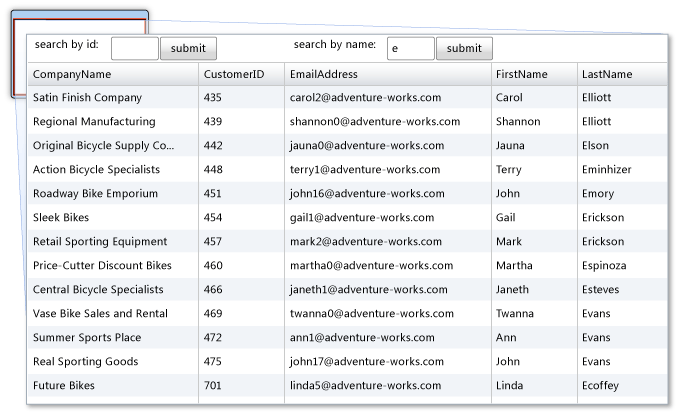

---
title: 'Walkthrough: Adding Query Methods'
TOCTitle: 'Walkthrough: Adding Query Methods'
ms:assetid: 81d3831e-1d14-4c15-843e-e996593d0f5c
ms:mtpsurl: https://msdn.microsoft.com/en-us/library/Ee707362(v=VS.91)
ms:contentKeyID: 27195670
ms.date: 08/19/2013
mtps_version: v=VS.91
dev_langs:
- vb
- csharp
- xaml
---

# Walkthrough: Adding Query Methods

\[ **This document was written for WCF Services Version 1 Service Pack 2 and might not be up to date** <br />
Please see [Release Notes](https://github.com/OpenRIAServices/OpenRiaServices/releases) or [Changelog](https://github.com/OpenRIAServices/OpenRiaServices/blob/main/Changelog.md) for a list of changes since WCF RIA Services \]

This walkthrough describes how to add and customize methods in Open Ria Services that query a data source. Such methods, which are referred to as query methods, must be defined with a signature that the framework recognizes as specifying a query method. The query methods satisfy this requirement by applying the [QueryAttribute](ff422090.md). The set of expected query signatures are divided into two broad categories: those queries that always return a single type of [Entity](ff422907.md) and those queries that can, potentially, return more than one [Entity](ff422907.md) of type T in an [IEnumerable\<T\>](https://msdn.microsoft.com/en-us/library/9eekhta0) or an [IQueryable\<T\>](https://msdn.microsoft.com/en-us/library/Bb351562). For more information about the permitted query method signatures, see [Domain Services](ee707373.md).

When you create a new domain service class and specify their entities in the **Add New Domain Service Class** dialog box, the Open Ria Services framework automatically creates a simple query method in this class for each entity exposed by the service. This query method simply retrieves all of the records for the entity. This walkthrough describes how to add new query methods that perform more complex scenarios such as filtering by a parameter value. This walkthrough shows how to add queries that return a single entity and also how to add queries that return a collection of entities.

## Prerequisites

This and the other walkthroughs presented in the Open Ria Services documentation require several prerequisite programs, such as Visual Studio and the Silverlight Developer Runtime and SDK, be installed and configured properly, in addition to Open Ria Services and the Open Ria Services Toolkit. They also require installing and configuring SQL Server 2008 R2 Express with Advanced Services and installing the AdventureWorks OLTP and LT database.

Detailed instructions for the satisfaction of each of these prerequisites are provided by the topics within the [Prerequisites for Open Ria Services](gg512106.md) node. Follow the instructions provided there before proceeding with this walkthrough to ensure that you encounter as few problems as possible when working through this Open Ria Services walkthroughs.

This walkthrough assumes you have completed the procedures described in [Walkthrough: Creating a Open Ria Services Solution](ee707376.md) and have the solution created there ready to modify in the procedures described here.

### To add a query method that accepts a parameter and returns a single entity

1.  Open the solution constructed in the [Walkthrough: Creating a Open Ria Services Solution](ee707376.md) topic that exposes data from the Customer table.

2.  In the server project, open the CustomerDomainService domain service class that exposes data from the Customer table.

3.  Add a query method that accepts an integer parameter and returns the Customer entity with the matching customer ID.
    
    If a method that returns a single entity includes the [QueryAttribute](ff422090.md) attribute, you must set the [IsComposable](ff422651.md) property to false. Users cannot specify additional query operations from the client. If the query method matches the expected signature for a query, you do not have to apply the [QueryAttribute](ff422090.md) attribute. The return value must be a single instance of an entity object.
    
    ``` vb
    <Query(IsComposable:=False)>
    Public Function GetCustomersByID(ByVal customerID As Integer) As Customer
        Return Me.ObjectContext.Customers.Single(Function(c) c.CustomerID = customerID)
    End Function
    ```
    
    ``` csharp
    [Query(IsComposable=false)]
    public Customer GetCustomersByID(int customerID)
    {
        return this.ObjectContext.Customers.Single(c => c.CustomerID == customerID);
    }
    ```

### To add a query method that accepts a parameter and returns a collection of entities

1.  Open the domain service class that exposes data from the Customer table.

2.  In the CustomerDomainService domain service class, add a query method that accepts a string parameter and returns any customers whose last name starts with that letter.
    
    The method can return an [IQueryable\<T\>](https://msdn.microsoft.com/en-us/library/Bb351562) object because the user may want to provide additional query operation from the client.
    
    ``` vb
    Public Function GetCustomersByLastNameLetter(ByVal startingLastNameLetter As String) As IQueryable(Of Customer)
        Return Me.ObjectContext.Customers.Where(Function(c) c.LastName.StartsWith(startingLastNameLetter) = True)
    End Function
    ```
    
    ``` csharp
    public IQueryable<Customer> GetCustomersByLastNameLetter(string startingLastNameLetter)
    {
        return this.ObjectContext.Customers.Where(c => c.LastName.StartsWith(startingLastNameLetter) == true);
    }
    ```

### To display the results of those query methods in the client project.

1.  In the client project, open MainPage.xaml.

2.  Add two TextBox controls and two Button controls so that the user can filter customer records either by the ID or by the first letter of the last name.
    
    The following XAML shows a complete layout along with the existing DataGrid.
    
    ``` xaml
    <UserControl xmlns:my="clr-namespace:System.Windows.Controls;assembly=System.Windows.Controls.Data"  x:Class="RIAServicesExample.MainPage"
        xmlns="http://schemas.microsoft.com/winfx/2006/xaml/presentation"
        xmlns:x="http://schemas.microsoft.com/winfx/2006/xaml"
        xmlns:d="http://schemas.microsoft.com/expression/blend/2008"
        xmlns:mc="http://schemas.openxmlformats.org/markup-compatibility/2006"
        mc:Ignorable="d"
        d:DesignHeight="300" d:DesignWidth="400">
    
        <Grid x:Name="LayoutRoot" Background="White">
            <Grid.ColumnDefinitions>
                <ColumnDefinition></ColumnDefinition>
                <ColumnDefinition></ColumnDefinition>
            </Grid.ColumnDefinitions>
            <Grid.RowDefinitions>
                <RowDefinition Height="25"></RowDefinition>
                <RowDefinition></RowDefinition>
            </Grid.RowDefinitions>
            <StackPanel Orientation="Horizontal" Grid.Row="0" Grid.Column="0">
                <TextBlock Text="search by id: " ></TextBlock>
                <TextBox Name="IDValue" Width="50" ></TextBox>
                <Button Name="IDButton" Click="IDButton_Click" Content="Submit"></Button>
            </StackPanel>
            <StackPanel Orientation="Horizontal" Grid.Row="0" Grid.Column="1">
                <TextBlock Text="search by name: "></TextBlock>
                <TextBox Name="LetterValue" Width="30"></TextBox>
                <Button Name="LetterButton" Click="LetterButton_Click" Content="Submit"></Button>
            </StackPanel>
    
          <my:DataGrid Grid.Row="1" Grid.Column="0" Grid.ColumnSpan="2" Name="CustomerGrid"></my:DataGrid>
        </Grid>
    </UserControl>
    ```

3.  Open the code-behind page for MainPage.xaml (MainPage.xaml.cs or MainPage.xaml.vb).

4.  Add code to retrieve query results based on the user input.
    
    ``` vb
    Partial Public Class MainPage
        Inherits UserControl
        Dim _customerContext As CustomerDomainContext
    
        Public Sub New()
            InitializeComponent()
        End Sub
    
        Private Sub LetterButton_Click(ByVal sender As System.Object, ByVal e As System.Windows.RoutedEventArgs)
            IDButton.IsEnabled = False
            LetterButton.IsEnabled = False
            Dim loadOp = Me._customerContext.Load(Me._customerContext.GetCustomersByLastNameLetterQuery(LetterValue.Text), AddressOf CustomerLoadedCallback, Nothing)
            CustomerGrid.ItemsSource = loadOp.Entities
        End Sub
    
        Private Sub IDButton_Click(ByVal sender As System.Object, ByVal e As System.Windows.RoutedEventArgs)
            IDButton.IsEnabled = False
            LetterButton.IsEnabled = False
            Dim loadOp = Me._customerContext.Load(Me._customerContext.GetCustomersByIDQuery(IDValue.Text), AddressOf CustomerLoadedCallback, Nothing)
            CustomerGrid.ItemsSource = loadOp.Entities
        End Sub
    
        Public Sub CustomerLoadedCallback(ByVal loadOperation As LoadOperation(Of Customer))
            IDButton.IsEnabled = True
            LetterButton.IsEnabled = True
        End Sub
    End Class
    ```
    
    ``` csharp
    public partial class MainPage : UserControl
    {
        private CustomerDomainContext _customerContext = new CustomerDomainContext();
    
        public MainPage()
        {
            InitializeComponent();
        }
    
        private void LetterButton_Click(object sender, RoutedEventArgs e)
        {
            IDButton.IsEnabled = false;
            LetterButton.IsEnabled = false;
            LoadOperation<Customer> loadOp = this._customerContext.Load(this._customerContext.GetCustomersByLastNameLetterQuery(LetterValue.Text), CustomerLoadedCallback, null);
            CustomerGrid.ItemsSource = loadOp.Entities;
        }
    
        private void IDButton_Click(object sender, RoutedEventArgs e)
        {
            IDButton.IsEnabled = false;
            LetterButton.IsEnabled = false;
            LoadOperation<Customer> loadOp = this._customerContext.Load(this._customerContext.GetCustomersByIDQuery(int.Parse(IDValue.Text)), CustomerLoadedCallback, null);
            CustomerGrid.ItemsSource = loadOp.Entities;
        }
    
        void CustomerLoadedCallback(LoadOperation<Customer> loadOperation)
        {
            IDButton.IsEnabled = true;
            LetterButton.IsEnabled = true;
        }
    
    }
    ```

5.  Run (F5) the application.
    
    The following illustration shows a list of customers filtered by the last name that appears when the application is run.
    
    

