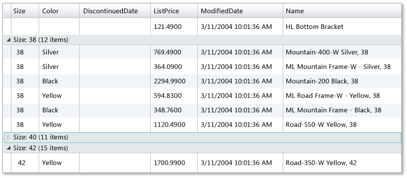

---
title: DomainDataSource
TOCTitle: DomainDataSource
ms:assetid: 89907e26-e24d-438f-9334-9a846105ab9c
ms:mtpsurl: https://msdn.microsoft.com/en-us/library/Ee707363(v=VS.91)
ms:contentKeyID: 27195671
ms.date: 08/19/2013
mtps_version: v=VS.91
dev_langs:
- xaml
---

# DomainDataSource

\[ **This document was written for WCF Services Version 1 Service Pack 2 and might not be up to date** <br />
Please see [Release Notes](https://github.com/OpenRIAServices/OpenRiaServices/releases) or [Changelog](https://github.com/OpenRIAServices/OpenRiaServices/blob/main/Changelog.md) for a list of changes since WCF RIA Services \]

Open Ria Services provides the [DomainDataSource](ee732901.md) control to simplify the interaction between the user interface and data from a domain context. With the [DomainDataSource](ee732901.md), you can retrieve, shape, and edit data using only declarative syntax. You specify the domain context to use with the [DomainDataSource](ee732901.md), and then call the operations that are available through that domain context.

## Configuring the Silverlight Application for DomainDataSource

To use the DomainDataSource control, you must add a reference in the Silverlight project to the System.Windows.Controls.DomainServices assembly. This reference is automatically added when you drag the [DomainDataSource](ee732901.md) from the Toolbox. Optionally, to use the DataGrid with [DomainDataSource](ee732901.md), you must also add a reference to System.Windows.Controls.Data. This reference is also added automatically when you drag the DataGrid control from the Toolbox.

The host control, such as the UserControl, must contain the following namespace reference:

    xmlns:riaControls="clr-namespace:System.Windows.Controls;assembly=System.Windows.Controls.DomainServices"

Optionally, to use the DataGrid control with DomainDataSource, you must also add the following namespace:

    xmlns:data="clr-namespace:System.Windows.Controls;assembly=System.Windows.Controls.Data"

To define the domain context in declarative code, you must include the namespace of the server project. In the following example, ExampleApplication.Web is the name of the server project. You will use the name of your server project.

    xmlns:domain="clr-namespace:ExampleApplication.Web"

## Retrieving and Displaying Data

You specify a domain context for the [DomainDataSource](ee732901.md) and provide the name of the method to use for loading data. Then you bind presentation controls like the DataGrid to the [DomainDataSource](ee732901.md). The following example shows a [DomainDataSource](ee732901.md) that retrieves data from a domain context named ProductDomainContext and displays the data in a DataGrid control. A query method called GetProducts() must exist on the domain service for the example to work.

``` xaml
<UserControl x:Class="ExampleApplication.MainPage"
    xmlns="http://schemas.microsoft.com/winfx/2006/xaml/presentation"
    xmlns:x="http://schemas.microsoft.com/winfx/2006/xaml"
    xmlns:d="http://schemas.microsoft.com/expression/blend/2008"
    xmlns:mc="http://schemas.openxmlformats.org/markup-compatibility/2006"
    xmlns:riaControls="clr-namespace:System.Windows.Controls;assembly=System.Windows.Controls.Ria"
    xmlns:riaData="clr-namespace:System.Windows.Data;assembly=System.Windows.Controls.Ria"
    xmlns:domain="clr-namespace:SilverlightApplication17.Web"
    xmlns:data="clr-namespace:System.Windows.Controls;assembly=System.Windows.Controls.Data"
    mc:Ignorable="d">

    <Grid x:Name="LayoutRoot" Background="White">
        <riaControls:DomainDataSource x:Name="source" QueryName="GetProducts" AutoLoad="true">
            <riaControls:DomainDataSource.DomainContext>
                <domain:ProductDomainContext />
            </riaControls:DomainDataSource.DomainContext>
        </riaControls:DomainDataSource>
        <data:DataGrid ItemsSource="{Binding Data, ElementName=source}" />
    </Grid>
</UserControl>
```

## Adding Parameters to the Query

In some cases a query method requires parameter values. Typically, a query method requires a parameter value to filter the data that is returned. The [DomainDataSource](ee732901.md) class provides the [QueryParameters](ee707656.md) collection to facilitate adding parameters. The following example shows how to add parameter value with a value that is specified in the declarative text.

``` xaml
<Grid x:Name="LayoutRoot" Background="White">
    <riaControls:DomainDataSource x:Name="source" QueryName="GetProductsByColor" AutoLoad="true">
        <riaControls:DomainDataSource.DomainContext>
            <domain:ProductDomainContext />
        </riaControls:DomainDataSource.DomainContext>
        <riaControls:DomainDataSource.QueryParameters>
            <riaData:Parameter ParameterName="color" Value="Black" />
        </riaControls:DomainDataSource.QueryParameters>
    </riaControls:DomainDataSource>
    <data:DataGrid ItemsSource="{Binding Data, ElementName=source}" />
</Grid>
```

You can also add a parameter that uses a value from the user for the query. You bind a [Parameter](ff422556.md) object to the user-input control that contains the value to use in the query. The following example shows how to specify a value from a ComboBox is used as the parameter value.

``` xaml
<Grid x:Name="LayoutRoot" Background="White">
    <Grid.RowDefinitions>
        <RowDefinition Height="25" />
        <RowDefinition Height="Auto" />
    </Grid.RowDefinitions>    
    <riaControls:DomainDataSource x:Name="source" QueryName="GetProductsByColor" AutoLoad="true">
        <riaControls:DomainDataSource.DomainContext>
            <domain:ProductDomainContext />
        </riaControls:DomainDataSource.DomainContext>
        <riaControls:DomainDataSource.QueryParameters>
            <riaControls:ControlParameter 
                ParameterName="color" 
                ControlName="colorCombo" 
                PropertyName="SelectedItem.Content" 
                RefreshEventName="SelectionChanged" />
        </riaControls:DomainDataSource.QueryParameters>
    </riaControls:DomainDataSource>
    <ComboBox Width="60"  Grid.Row="0" x:Name="colorCombo">
        <ComboBoxItem Content="Black" />
        <ComboBoxItem Content="Blue" />
    </ComboBox>
    <data:DataGrid Grid.Row="1" ItemsSource="{Binding Data, ElementName=source}" />
</Grid>
```

## Sorting

The DomainDataSource provides the [SortDescriptors](ee725951.md) collection to facilitate sorting on the data. In the [SortDescriptors](ee725951.md) collection, you add [SortDescriptor](ff423258.md) instances that describe the values to use for sorting the collection. You can add as many [SortDescriptor](ff423258.md) instances as you want to provide layers of sorting. You can specify if the data is sorted in ascending or descending order. The following example shows how to add a sort descriptor to the DomainDataSource. The data retrieved from the query is sorted by values in the StandardPrice property.

``` xaml
<Grid x:Name="LayoutRoot" Background="White">  
    <riaControls:DomainDataSource x:Name="source" QueryName="GetProducts" AutoLoad="true">
        <riaControls:DomainDataSource.DomainContext>
            <domain:ProductDomainContext />
        </riaControls:DomainDataSource.DomainContext>   
        <riaControls:DomainDataSource.SortDescriptors>
            <riaData:SortDescriptor PropertyPath="StandardCost" Direction="Ascending" />
            <riaData:SortDescriptor PropertyPath="ProductID" Direction="Ascending" />
        </riaControls:DomainDataSource.SortDescriptors>
    </riaControls:DomainDataSource>
    <data:DataGrid ItemsSource="{Binding Data, ElementName=source}" />
</Grid>
```

When you implement paging and sorting together, include at least one [SortDescriptor](ff423258.md) with its [PropertyPath](ff422047.md) attribute assigned to a property that contains unique values, such as a primary key. Or add an OrderBy clause based on a property that contains unique values to the query in the [DomainDataSource](ee732901.md). If you only sort the data on a property that does not contain unique values, the return values could contain inconsistent or missing data across pages.

## Grouping

The DomainDataSource provides the [GroupDescriptors](ee725928.md) collection to facilitate grouping the data by property values. In the [GroupDescriptors](ee725928.md) collection, you add [GroupDescriptor](ff423125.md) instances that define the value to use for grouping. You can add as many [GroupDescriptor](ff423125.md) instances as needed.



The following example shows how to add a value to use for grouping.

``` xaml
<Grid x:Name="LayoutRoot" Background="White">  
    <riaControls:DomainDataSource x:Name="source" QueryName="GetProducts" AutoLoad="true">
        <riaControls:DomainDataSource.DomainContext>
            <domain:ProductDomainContext />
        </riaControls:DomainDataSource.DomainContext>   
        <riaControls:DomainDataSource.GroupDescriptors>
            <riaData:GroupDescriptor PropertyPath="Size" />
        </riaControls:DomainDataSource.GroupDescriptors>
    </riaControls:DomainDataSource>
    <data:DataGrid ItemsSource="{Binding Data, ElementName=source}" />
</Grid>
```

## Filtering

The DomainDataSource control provides the [FilterDescriptors](ee707531.md) collection to enable you to filter the data that is returned by the query. By adding filters, you can specify that only entities which meet the condition in the filter are loaded from the domain context. You define the logical relationship between different filters by setting the [FilterOperator](ff422862.md) property on the [DomainDataSource](ee732901.md) object. The [FilterOperator](ff422862.md) property supports any value in the [FilterDescriptorLogicalOperator](ff422951.md) enumerator.

Within a [FilterDescriptor](ff422357.md) instance, you set the [Operator](ff423349.md) property to specify the type of comparison to use when filtering. Filter descriptors support the operations in the [FilterOperator](ff423439.md) enumerator.

The following example shows two filter descriptors that are connected by a logical AND statement. One filter depends on user input and one filter is specified in the declarative syntax.

``` xaml
<Grid x:Name="LayoutRoot" Background="White">  
    <Grid.RowDefinitions>
        <RowDefinition Height="25" />
        <RowDefinition Height="Auto" />
    </Grid.RowDefinitions>
    <riaControls:DomainDataSource x:Name="source" QueryName="GetProducts" AutoLoad="true">
        <riaControls:DomainDataSource.DomainContext>
            <domain:ProductDomainContext />
        </riaControls:DomainDataSource.DomainContext>   
        <riaControls:DomainDataSource.FilterDescriptors>
            <riaData:FilterDescriptorCollection LogicalOperator="And">
              <riaData:FilterDescriptor PropertyPath="Color" Operator="IsEqualTo" Value="Blue" />
              <riaData:FilterDescriptor PropertyPath="ListPrice" Operator="IsLessThanOrEqualTo">
                  <riaControls:ControlParameter 
                      ControlName="MaxPrice" 
                      PropertyName="SelectedItem.Content" 
                      RefreshEventName="SelectionChanged" />
              </riaData:FilterDescriptor>
            </riaData:FilterDescriptorCollection>
        </riaControls:DomainDataSource.FilterDescriptors>
    </riaControls:DomainDataSource>
    <ComboBox x:Name="MaxPrice" Grid.Row="0" Width="60" SelectedIndex="0">
        <ComboBoxItem Content="100" />
        <ComboBoxItem Content="500" />
        <ComboBoxItem Content="1000" />
    </ComboBox>
    <data:DataGrid Grid.Row="1" ItemsSource="{Binding Data, ElementName=source}" />
</Grid>
```

## Paging

When displaying a large number of entities, you may wish to provide paging in your user interface. The DomainDataSource control enables you to specify the number of entities to load and the number of entities to display on a page. New records are loaded only when the user navigates to a page that contains entities which have not been loaded. You set the [PageSize](ee707425.md) and [LoadSize](ee707740.md) properties to specify the parameters for paging. Then, you bind a DataPager instance to the DomainDataSource to implement the interface for paging.



**Note:** If you use the DataPager in an application with an Entity Framework data store, you must order the data returned by your queries for the DataPager to work correctly. The Entity Framework does not support paging of data without an OrderBy clause in the query method or sorting specified on the Silverlight client.



The following example shows paging with the DomainDataSource.

``` xaml
<Grid x:Name="LayoutRoot" Background="White">  
    <Grid.RowDefinitions>
        <RowDefinition Height="Auto" />
        <RowDefinition Height="Auto" />
    </Grid.RowDefinitions>
    <riaControls:DomainDataSource PageSize="15" LoadSize="30" x:Name="source" QueryName="GetProducts" AutoLoad="true">
        <riaControls:DomainDataSource.DomainContext>
            <domain:ProductDomainContext />
        </riaControls:DomainDataSource.DomainContext>
        <riaControls:DomainDataSource.SortDescriptors>
            <riaData:SortDescriptor PropertyPath="ListPrice" />
        </riaControls:DomainDataSource.SortDescriptors>
    </riaControls:DomainDataSource>
    <data:DataGrid Grid.Row="0" ItemsSource="{Binding Data, ElementName=source}" />
    <data:DataPager Grid.Row="1" Source="{Binding Data, ElementName=source}" />
</Grid>
```

## Editing

To persist data modifications, call the [SubmitChanges](ee732567.md) method on the [DomainDataSource](ee732901.md) object. To cancel changes, call the [RejectChanges](ee732674.md) method.

