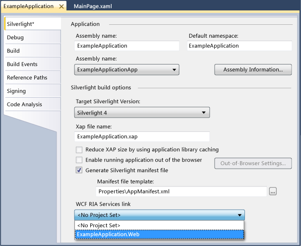
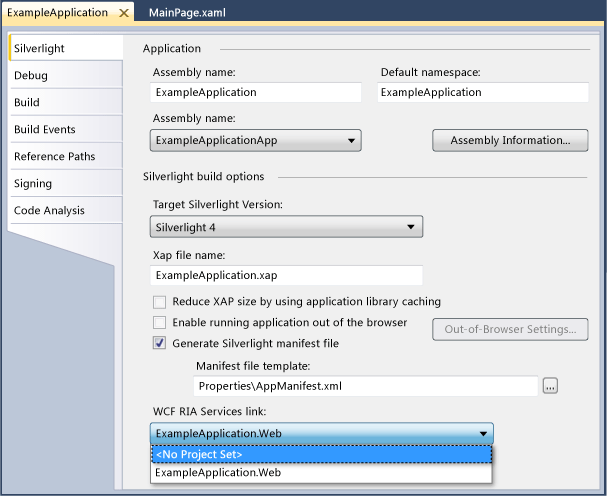

---
title: 'How to: Add or Remove a Open Ria Services Link'
TOCTitle: 'How to: Add or Remove a Open Ria Services Link'
ms:assetid: e03b8683-ae79-43ac-9a6a-9854c00a303c
ms:mtpsurl: https://msdn.microsoft.com/en-us/library/Ee707372(v=VS.91)
ms:contentKeyID: 27195680
ms.date: 08/19/2013
mtps_version: v=VS.91
---

# How to: Add or Remove a Open Ria Services Link

\[ **This document was written for WCF Services Version 1 Service Pack 2 and might not be up to date**  
Please see [Release Notes](https://github.com/OpenRIAServices/OpenRiaServices/releases) or [Changelog](https://github.com/OpenRIAServices/OpenRiaServices/blob/main/Changelog.md) for a list of changes since WCF RIA Services \]

This topic describes how to add or remove a Open Ria Services link between a new Silverlight client application and an existing ASP.NET project.

A Open Ria Services solution basically consists of client and a server projects that are linked by such a Open Ria Services link, so adding and removing them is a critical task.

This topic assumes that you have completed the [Walkthrough: Creating a Open Ria Services Solution](ee707376.md), [Walkthrough: Using the Silverlight Business Application Template](ee707360.md), and [Walkthrough: Creating a Open Ria Services Class Library](ee707351.md) topics, or have equivalent knowledge and an existing Open Ria Services solution available.

When you create a new Silverlight Business Application project, you can create a new Open Ria Services Class Library project, or you can select the **Enable Open Ria Services** check box in the **New Silverlight Application** dialog box, and a Open Ria Services link between the client project and the server project is created automatically.

### To add a Open Ria Services link to an existing solution

1.  Open an existing Open Ria Services solution.

2.  In **Solution Explorer**, right-click the Silverlight client project and select **Properties**.
    
    The **Silverlight** tab of the project designer appears.

3.  In the **Open Ria Services link** drop-down list, select the server project that you want to use for the middle tier with this client project.
    
    

### To remove a Open Ria Services link from an existing solution

1.  In **Solution Explorer**, right-click the Silverlight client application and select **Properties**.
    
    The **Silverlight** tab of the project designer appears.

2.  In the **Open Ria Services link** drop-down list, select **\<No Project Set\>**.
    
    

## See Also

#### Tasks

[Walkthrough: Creating a Open Ria Services Solution](ee707376.md)

