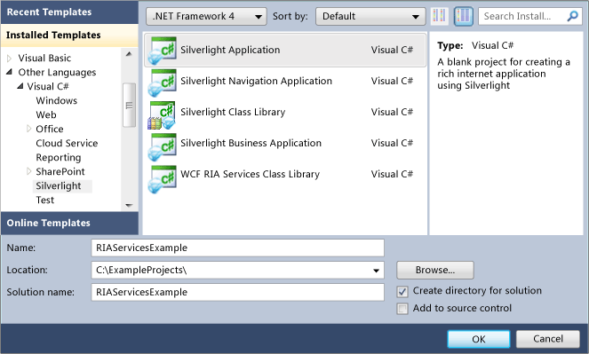
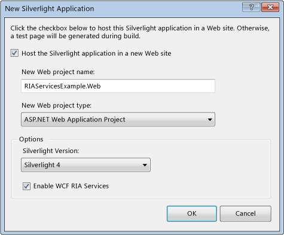
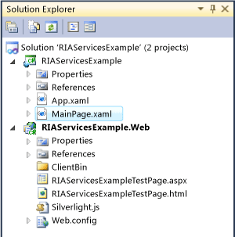
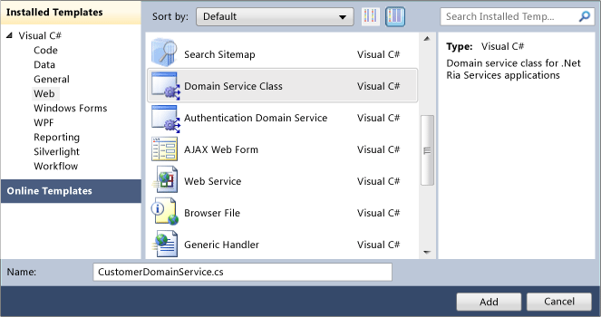
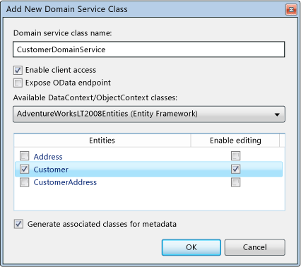
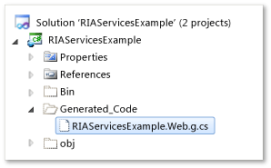
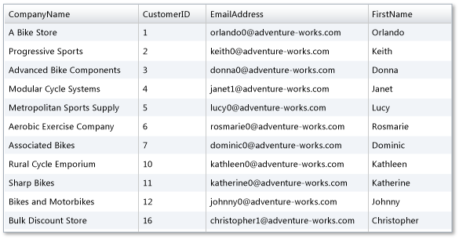

---
title: 'Walkthrough: Creating a Open Ria Services Solution'
TOCTitle: 'Walkthrough: Creating a Open Ria Services Solution'
ms:assetid: f8ac0996-0028-403e-b279-8aa99235c399
ms:mtpsurl: https://msdn.microsoft.com/en-us/library/Ee707376(v=VS.91)
ms:contentKeyID: 27195684
ms.date: 08/19/2013
mtps_version: v=VS.91
dev_langs:
- xaml
- vb
- csharp
---

# Walkthrough: Creating a Open Ria Services Solution

\[ **This document was written for WCF Services Version 1 Service Pack 2 and might not be up to date** <br />
Please see [Release Notes](https://github.com/OpenRIAServices/OpenRiaServices/releases) or [Changelog](https://github.com/OpenRIAServices/OpenRiaServices/blob/main/Changelog.md) for a list of changes since WCF RIA Services \]

In this walkthrough, you create a Open Ria Services application that retrieves data from the AdventureWorksLT database and then makes it available to a Silverlight client where it is presented. You access the data from the data source by creating entity classes that represent various database tables on the server in the middle tier and then you present it by creating a domain service that makes these middle tier entities accessible to the Silverlight client. This walkthrough serves as the starting point for many of the other walkthroughs in the Open Ria Services documentation.

## Prerequisites

This and the other walkthroughs presented in the Open Ria Services documentation require several prerequisite programs, such as Visual Studio and the Silverlight Developer Runtime and SDK, be installed and configured properly, in addition to Open Ria Services and the Open Ria Services Toolkit. They also require installing and configuring SQL Server 2008 R2 Express with Advanced Services and installing the AdventureWorks OLTP and LT database.

Detailed instructions for the satisfaction of each of these prerequisites are provided by the topics within the [Prerequisites for Open Ria Services](gg512106.md) node. Follow the instructions provided there before proceeding with this walkthrough to ensure that you encounter as few problems as possible when working through this Open Ria Services walkthroughs.

## Creating a solution with a Open Ria Services Link between the Projects

### To set up a Open Ria Services solution

1.  Create a new Open Ria Services project in Visual Studio by selecting **File**, **New**, and then **Project**.
    
    The **New Project** dialog box appears.

2.  Select the **Silverlight Application** template from **Silverlight** group of the **Installed Templates** and name the new project RIAServicesExample.
    
    

3.  Click **OK**.
    
    The **New Silverlight Application** dialog box appears.

4.  Select the **Enable Open Ria Services** check box near the bottom of the dialog box. Checking this box creates a Open Ria Services link between the client project and the server project.
    
    

5.  Click **OK** to create the solution.
    
    The solution contains two projects: a client project and a server project. The client project is named RIAServicesExample and it contains the Silverlight code that you use to create the presentation tier. The server project is named RIAServicesExample.Web and it contains the middle-tier code.
    
    

## Creating Data Models

In this section, you will create the ADO.NET Entity classes that represent data from the AdventureWorksLT database. Open Ria Services works with a variety of data modeling classes and data sources. For more information on the options for accessing data with Open Ria Services, see the [Data](ee707356.md) topic.



**Warning:** When using an Entity Data Model (EMD) with Visual Studio, you must select the <STRONG>Include foreign key columns in the model</STRONG> option. By default, this option is selected when you use the <STRONG>Entity Data Model</STRONG> wizard. You also must use the default behavior of embedding EMD mapping information in the assembly.



### To make data available in the middle tier

1.  In **Solution Explorer**, right-click the server project, RIAServicesExample.Web, select **Add**, and then select **New Item**.
    
    The **Add New Item** dialog box appears.

2.  In the list of categories, select **Data** and then select the **ADO.NET Entity Data Model** template.

3.  Name the new file AdventureWorksModel.edmx and click **Add**.
    
    The **Entity Data Model Wizard** appears.

4.  In the **Choose Model Contents** screen, select **Generate from database** option and click **Next**.

5.  In the **Choose Your Data Connection** screen, create a data connection to the database and click **Next**.

6.  In the **Choose Your Database Objects** screen, select the **Address**, **Customer**, and **CustomerAddress** tables.

7.  Confirm that the **Include foreign key columns in the model** check box is checked by default and click **Finish**.
    
    Entity models are created for the tables.

8.  Build (with the key combination Ctrl+Shift+B) the solution.

## Creating a Domain Service

In this section, you will add a domain service to the middle-tier project. A domain service exposes the data entities and operations in the server project to the client project. You can add business logic to the domain service to manage how the client interacts with the data.

### To create the domain service

1.  Right-click the server project, select **Add** and **New Item**.

2.  In the list of categories, select **Web** and then select the **Domain Service Class** template.

3.  Name the class CustomerDomainService.cs (or CustomerDomainService.vb).
    
    

4.  Click **Add**.
    
    The **Add New Domain Service Class** dialog box appears.

5.  Make sure that the **Enable client access** box is checked.

6.  Select the **Customer** entity and then check the **Enable Editing** box for it.
    
    

7.  Click **OK**.
    
    The CustomerDomainService class is generated in a new CustomerDomainService.cs (or CustomerDomainService.vb) file.

8.  Open this file. Notice that the file has the following characteristics:
    
      - The CustomerDomainService class derives from [LinqToEntitiesDomainService\<TContext\>](ff423019.md) class, which is an abstract base class in the Open Ria Services framework. This base class was used automatically because the domain service exposes an ADO.NET Entity data class.
    
      - The generic base class is bound to the entity class that was created in previous steps by the AdventureWorksLTEntities of type [ObjectContext](https://msdn.microsoft.com/en-us/library/Bb156104) in its generic parameter.
    
      - The CustomerDomainService class is marked with the EnableClientAccessAttribute attribute to indicate that it is visible to the client tier.
    
      - A query method named GetCustomers is generated. This method returns every item without any filtering or sorting.
    
      - Methods to insert, update, and delete customers from the records have been generated.

## Creating the Silverlight Client

In other walkthroughs, you will be shown how to add business logic to the domain service. For this walkthrough, you will simply use the GetCustomers method generated by default.

Client proxy classes are generated when you built the solution. The Open Ria Services link that was established between the client project and the server project make this code generation possible. These client proxy classes provide access to the data from the client.

### To see the generated client proxy classes

1.  Build the solution.
    
    When you build the solution, code is generated in the client project.

2.  In **Solution Explorer**, select the **RIAServicesExample** client project and click the **Show All Files** icon at the top of the window.
    
    Notice the Generated\_Code folder contains a RIAServicesExample.Web.g.cs (or RIAServicesExample.Web.g.vb) file.
    
    

3.  Open the code file in the Generated\_Code folder.
    
    Notice that the file has the following characteristics:
    
      - A WebContext class that derives from the [WebContextBase](ff457966.md) class is generated.
    
      - A CustomerDomainContext class that derives from the [DomainContext](ff422732.md) class is generated. This class has a method named GetCustomersQuery that corresponds to the query method created in the domain service.
    
      - A Customer class that derives from the [Entity](ff422907.md) class is generated for the entity exposed by the domain service. The Customer entity class in the client project matches the Customer entity on the server.

### To display the data in the Silverlight client

1.  Open MainPage.xaml.

2.  From the **Toolbox** on the left, drag a DataGrid control to within the Grid element in XAML view.
    
    Dragging the **DataGrid** control from the **Toolbox** causes a namespace using System.Windows.Controls statement and a reference to a System.Windows.Controls.Data assembly to be added automatically.
    

    > [!WARNING]
    > If you add the DataGrid without dragging it from the <STRONG>Toolbox</STRONG>, you must add the reference to the System.Windows.Controls.Data assembly to the client project and the using statement manually in the code behind file.


3.  Change the value of the AutoGeneratedColums to True, name the DataGrid element CustomerGrid, and adjust the height and width attributes as shown in the following XAML.
    
    ``` xaml
    <UserControl 
        xmlns:my="clr-namespace:System.Windows.Controls;assembly=System.Windows.Controls.Data"  
        x:Class="RIAServicesExample.MainPage"
        xmlns="http://schemas.microsoft.com/winfx/2006/xaml/presentation"
        xmlns:x="http://schemas.microsoft.com/winfx/2006/xaml"
        xmlns:d="http://schemas.microsoft.com/expression/blend/2008"
        xmlns:mc="http://schemas.openxmlformats.org/markup-compatibility/2006"
        mc:Ignorable="d"
        d:DesignHeight="300" d:DesignWidth="400">
    
        <Grid x:Name="LayoutRoot" Background="White">
          <my:DataGrid Name="CustomerGrid"></my:DataGrid>
        </Grid>
    </UserControl>
    ```

4.  Open the code-behind for MainPage.xaml.

5.  Add using (C\#) or Imports (Visual Basic) two statements: using RIAServicesExample.Web; and the using System.ServiceModel.DomainServices.Client;.
    
    The RIAServicesExample.Web namespace is the namespace containing the generated code for the client project in the RIAServicesExample.Web.g.cs (or RIAServicesExample.Web.g.vb).

6.  To instantiate the CustomerDomainContext, add the line of code private CustomerDomainContext \_customerContext = new CustomerDomainContext(); in the MainPage class.
    
    ``` vb
    Imports System.Windows.Ria
    Imports RIAServicesExample.Web
    
    Partial Public Class MainPage
        Inherits UserControl
    
        Private _customerContext As New CustomerDomainContext
    
        Public Sub New()
            InitializeComponent()
    
            Dim loadOp = Me._customerContext.Load(Me._customerContext.GetCustomersQuery())
            CustomerGrid.ItemsSource = loadOp.Entities
        End Sub
    
    End Class
    ```
    
    ``` csharp
    using System;
    using System.Collections.Generic;
    using System.Linq;
    using System.Net;
    using System.Windows;
    using System.Windows.Controls;
    using System.Windows.Documents;
    using System.Windows.Input;
    using System.Windows.Media;
    using System.Windows.Media.Animation;
    using System.Windows.Shapes;
    using RIAServicesExample.Web;
    using System.Windows.Ria;
    
    namespace RIAServicesExample
    {
        public partial class MainPage : UserControl
        {
            private CustomerDomainContext _customerContext = new CustomerDomainContext();
    
            public MainPage()
            {
                InitializeComponent();
    
                LoadOperation<Customer> loadOp = this._customerContext.Load(this._customerContext.GetCustomersQuery());
                CustomerGrid.ItemsSource = loadOp.Entities;
            }
        }
    }
    ```

7.  Retrieve customer entities by calling the GetCustomersQuery method with [LoadOperation\<TEntity\>](ff423147.md): LoadOperation\<Customer\> loadOp = this.\_customerContext.Load(this.\_customerContext.GetCustomersQuery());.

8.  Bind the entities loaded to the DataGrid with CustomerGrid.ItemsSource = loadOp.Entities;.
    
    To summarize, the MainPage.xaml.cs file should now contain the following code:
    
        //Namespaces added
        using RIAServicesExample.Web;
        using System.ServiceModel.DomainServices.Client;
        
        
        namespace RIAServicesExample
        {
            public partial class MainPage : UserControl
            {
                private CustomerDomainContext _customerContext = new CustomerDomainContext();
                public MainPage()
                {
                    InitializeComponent();
        
                    LoadOperation<Customer> loadOp = this._customerContext.Load(this._customerContext.GetCustomersQuery());
                    CustomerGrid.ItemsSource = loadOp.Entities;
                }
            }
        }

9.  Run (F5) the application.
    
    You should see a data grid that is similar to the following.
    
    

## Next Steps

This walkthrough has shown only the basic steps to create a project and retrieve unfiltered data from a domain service. Here are some suggestions for learning about additional capabilities:

  - Create customized query methods, such as queries that accept a parameter, which are typically used for filtering data. For more information, see [Walkthrough: Adding Query Methods](ee707362.md).

  - Add business logic to a domain service that contains update, insert, and delete methods and that manages the process for modifying the data. For more information, see [How to: Add Business Logic to the Domain Service](ee796240.md).

