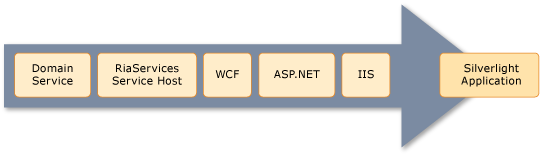

---
title: Troubleshooting the Deployment of a Open Ria Services Solution
TOCTitle: Troubleshooting the Deployment of a Open Ria Services Solution
ms:assetid: 95ebca79-adbb-4f1a-8045-416faad1efd0
ms:mtpsurl: https://msdn.microsoft.com/en-us/library/Ff426913(v=VS.91)
ms:contentKeyID: 28764583
ms.date: 08/19/2013
mtps_version: v=VS.91
---

# Troubleshooting the Deployment of a Open Ria Services Solution

\[ **This document was written for WCF Services Version 1 Service Pack 2 and might not be up to date**  
Please see [Release Notes](https://github.com/OpenRIAServices/OpenRiaServices/releases) or [Changelog](https://github.com/OpenRIAServices/OpenRiaServices/blob/main/Changelog.md) for a list of changes since WCF RIA Services \]

Troubleshooting a Open Ria Services solution presents a unique challenge because an exception can occur at one of many different layers. You need to understand how these different layers report errors to effectively troubleshoot your application. This topic introduces these layers and provides some techniques for troubleshooting your Open Ria Services applications when an exception occurs. Also, many of the issues you may encounter in deploying a Open Ria Services have been anticipated in the new deployment guide, for details see [A Guide to Deploying Open Ria Services Solutions](ff426912.md).

## Exception Flow

In a Open Ria Services application, exceptions flow in the following order from the lowest originating layer to the client:

1.  Domain Service

2.  Open Ria Services Service Host

3.  WCF

4.  ASP.NET

5.  IIS

6.  Silverlight Application

## Enable Detailed ASP.NET Error Information

By default, the customErrors element of a Web.config file is set to RemoteOnly, which means a remote client will not receive the detailed ASP.NET error information. To debug your application, set customErrors to Off so that you can see the detailed ASP.NET error from the client.


**Note:** Do not make your application publicly available with customErrors set to Off as the error message may expose sensitive information to users.


## Use Fiddler to Inspect Errors

All exceptions originating from within a domain service are sent to the Silverlight client with an error status code of 200. All exceptions thrown at the WCF layer or lower are sent to the Silverlight client with a status code of 404. You can run the [Fiddler](http://go.microsoft.com/fwlink/?linkid=154773) HTTP debugger to see the actual error.

## Browse to the Domain Service Directly

Directly browsing to the .svc file for your domain service is often a helpful step to see whether the WCF service is available. However, determining the path to the .svc file is not simple because the .svc does not exist in your solution. You can browse directly to the domain service in a Web browser by using the following pattern:

http://\[host\]/\[modified class name for domain service\].svc

You determine the modified class name by using the fully qualified class name and substituting a dash (-) for every period (.). So a domain service that is named:

ExampleApplication.Web.CustomerDomainService

has a .svc file named:

ExampleApplication-Web-CustomerDomainService.svc

If this file is hosted on localhost, you browse directly to the file by navigating to:

http://localhost/ExampleApplication-Web-CustomerDomainService.svc

If the service is available, you will see a Web page with information about services and how to test a service. If the service is not available, you will see an error page that may have information which will help you determine the problem. If you receive an error, the exception probably originated at the Open Ria Services Service Host layer.

## Override the Domain Service OnError Method

When an unrecoverable error occurs during the processing of a [DomainService](ff422911.md) operation, the [OnError](https://msdn.microsoft.com/en-us/library/m:system.servicemodel.domainservices.server.domainservice.onerror\(system.servicemodel.domainservices.server.domainserviceerrorinfo\)\(v=VS.91\)) method is called. You can override this method to inspect errors before they are sent to client.

## Use Traditional WCF Tracing Techniques

You troubleshoot exceptions at the WCF layer just like you would troubleshoot any WCF service. For more information about diagnostic tracing for WCF services, see [Tracing](http://go.microsoft.com/fwlink/?linkid=184727).

An exception that originates at the WCF layer will not show up in [Fiddler](http://go.microsoft.com/fwlink/?linkid=154773). You can troubleshoot a service exception by attempting to browse to the .svc file. If you can browse to the .svc file without an error, but the service fails at run time, then the exception may originate at the WCF layer.

## Check ASP.NET and IIS Settings

For exceptions thrown at the ASP.NET and IIS layers, information from your Open Ria Services application is not included in the stack. You may see exceptions at this level for situations such as:

  - The Web.config file does not have the correct HttpModule element for the version of IIS you are using.

  - WCF is not activated on your Web server.

