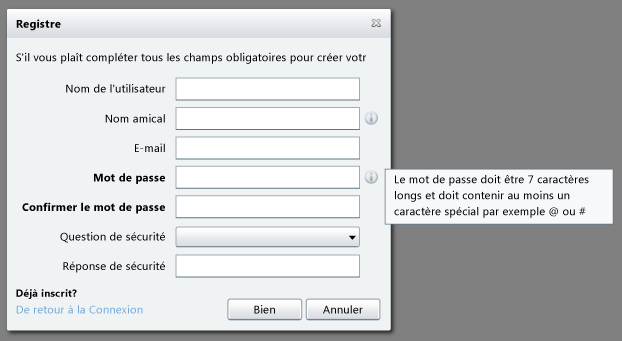
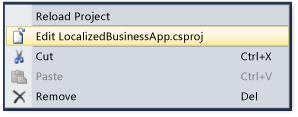
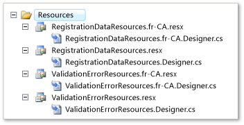
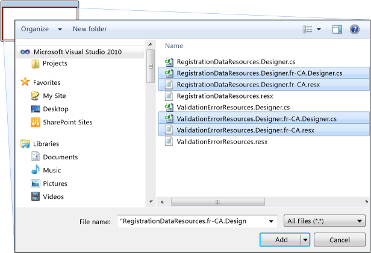
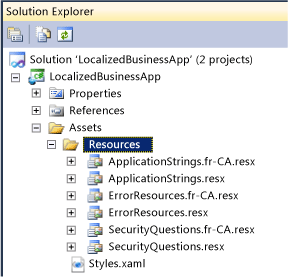
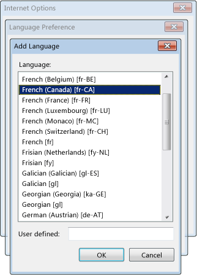
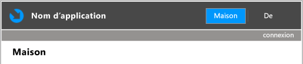

---
title: 'Walkthrough: Localizing a Business Application'
TOCTitle: 'Walkthrough: Localizing a Business Application'
ms:assetid: 3c6d311f-3b30-4b85-b517-00c57b81a36b
ms:mtpsurl: https://msdn.microsoft.com/en-us/library/Ff679940(v=VS.91)
ms:contentKeyID: 31136448
ms.date: 08/19/2013
mtps_version: v=VS.91
dev_langs:
- vb
- csharp
---

# Walkthrough: Localizing a Business Application

\[ **This document was written for WCF Services Version 1 Service Pack 2 and might not be up to date** <br />
Please see [Release Notes](https://github.com/OpenRIAServices/OpenRiaServices/releases) or [Changelog](https://github.com/OpenRIAServices/OpenRiaServices/blob/main/Changelog.md) for a list of changes since WCF RIA Services \]

This walkthrough demonstrates how to add localization support to a Open Ria Services business application. Today, many business applications need to be used by people in various parts of the world. Silverlight, ASP.NET, and Open Ria Services include support for applications localized for a particular culture or locale. In this walkthrough, you will write an application that can load user interface strings written in either English or Canadian French, depending on the value of the language setting in the browser.



This walkthrough covers the following tasks:

  - Configuring the client project to support specific languages.

  - Localizing resources.

  - Configuring the test page to use localized resources.

  - Configuring Internet Explorer to load a localized page.

  - Adding support for bi-directional languages.

## Prerequisites

This and the other walkthroughs presented in the Open Ria Services documentation require several prerequisite programs, such as Visual Studio and the Silverlight Runtime and SDK, be installed and configured properly, in addition to Open Ria Services and the Open Ria Services Toolkit. They also require installing and configuring SQL Server 2008 R2 Express with Advanced Services and installing the AdventureWorks OLTP and LT database.

Detailed instructions for the satisfaction of each of these prerequisites are provided by the topics within the [Prerequisites for Open Ria Services](gg512106.md) node. Follow the instructions provided there before proceeding with this walkthrough to ensure that you encounter as few problems as possible when working through this Open Ria Services walkthroughs.

## Configuring the Client Project

The following procedure shows how to specify supported languages in the client project file.

### To configure the client project

1.  Create a new Open Ria Services project in Visual Studio by selecting **File**, **New**, and then **Project**.
    
    The **New Project** dialog box appears.

2.  Select the **Silverlight Business Application** template from **Silverlight** group of the **Installed Templates** and name the new project LocalizedBusinessApp.

3.  In **Solution Explorer**, right-click the client project (LocalizedBusinessApp), and then click **Unload Project**.

4.  Right-click the client project again and then click **Edit LocalizedBusinessApp.vbproj** or **Edit LocalizedBusinessApp.csproj**.
    
    
    
    The project file opens in the designer.

5.  Find the SupportedCultures element and add the culture code for French (Canada) \[fr-CA\]. Use either a comma or a semi-colon to delimit the culture codes.
    
        <SupportedCultures>en-US,fr-CA</SupportedCultures>

6.  Save and close the project file.

7.  In **Solution Explorer**, right-click the client project and then click **Reload Project**.
    
    The project is reloaded into Solution Explorer.

## Localizing Resources

Adding support to your application for an additional language involves essentially, creating copies of existing resource files, renaming the copied files, and then translating the strings in the newly copied resource files. The following procedures show how to localize the resources in the server and client projects.

### To localize server resources

1.  In the **Solution Explorer**, in the server project (LocalizedBusinessApp.Web), expand the Resources folder.

2.  Right-click the RegistrationDataResources.resx file and then click **Copy**.

3.  Right-click the Resources folder and then click **Paste**.

4.  Rename Copy of RegistrationDataResources.resx to RegistrationDataResources.fr-CA.resx.
    

    > [!NOTE]
    > The culture code must be included in the file name to correctly establish that the resource belongs to that culture.


5.  Similarly, copy the ValidationErrorResources.resx file and rename it to ValidationErrorResources.fr-CA.resx.
    
    

6.  Double-click RegistrationDataResources.fr-CA.resx to open it in the Resource Designer.

7.  Replace the English values and comments with French equivalents, as shown in the following table.
    
    The Comment strings are typically used for tool tips.
    
    <table>
    <colgroup>
    <col style="width: 33%" />
    <col style="width: 33%" />
    <col style="width: 33%" />
    </colgroup>
    <thead>
    <tr class="header">
    <th><p>Name</p></th>
    <th><p>Value</p></th>
    <th><p>Comment</p></th>
    </tr>
    </thead>
    <tbody>
    <tr class="odd">
    <td><p>EmailLabel</p></td>
    <td><p>E-mail</p></td>
    <td></td>
    </tr>
    <tr class="even">
    <td><p>FriendlyNameDescription</p></td>
    <td><p>Comment voulez-vous que votre nom être affiché dans l'application?</p></td>
    <td></td>
    </tr>
    <tr class="odd">
    <td><p>FriendlyNameLabel</p></td>
    <td><p>Nom amical</p></td>
    <td></td>
    </tr>
    <tr class="even">
    <td><p>PasswordConfirmationLabel</p></td>
    <td><p>Confirmer le mot de passe</p></td>
    <td></td>
    </tr>
    <tr class="odd">
    <td><p>PasswordDescription</p></td>
    <td><p>Le mot de passe doit être 7 caractères longs et doit contenir au moins un caractère spécial par exemple @ ou #</p></td>
    <td><p>Changer ceci si vous changez votre longueur de mot de passe et les politiques de force</p></td>
    </tr>
    <tr class="even">
    <td><p>PasswordLabel</p></td>
    <td><p>Mot de passe</p></td>
    <td></td>
    </tr>
    <tr class="odd">
    <td><p>SecurityAnswerLabel</p></td>
    <td><p>Réponse de sécurité</p></td>
    <td></td>
    </tr>
    <tr class="even">
    <td><p>SecurityQuestionLabel</p></td>
    <td><p>Question de sécurité</p></td>
    <td></td>
    </tr>
    <tr class="odd">
    <td><p>UserNameLabel</p></td>
    <td><p>Nom de l'utilisateur</p></td>
    <td></td>
    </tr>
    </tbody>
    </table>

8.  Save and close the file.
    

    > [!TIP]
    > This walkthrough does not localize all of the strings. To complete the localization for the server resources, you would also localize ValidationErrorResources.fr-CA.resx.


9.  In the client project, expand the Web folder and then expand Resources.

10. Right-click the Resources folder, click **Add**, and then click **Existing Item**.

11. Navigate to the LocalizedBusinessApp.Web\\Resources folder.

12. Press CTRL+click to select the following files:
    
      - RegistrationDataResources.fr-CA.resx
    
      - RegistrationDataResources.fr-CA.Designer.vb (or .cs)
    
      - ValidationErrorResources.fr-CA.resx
    
      - ValidationErrorResources.fr-CA.Designer.vb (or .cs)

13. Click the down arrow on the **Add** button and then click **Add As Link**.
    
    
    
    The localized files are added as links in the client project.

### To localize client resources

1.  In the client project, expand the Assets folder and then expand Resources.

2.  Create a copy of ApplicationStrings.resx and rename it to ApplicationStrings.fr-CA.resx.

3.  Create a copy of ErrorResources.resx and rename it to ErrorResources.fr-CA.resx.

4.  Create a copy of SecurityQuestions.resx and rename it to SecurityQuestions.fr-CA.resx.
    
    

5.  Open ApplicationStrings.fr-CA.resx in the Resource Designer.

6.  Replace the English values and comments with French equivalents, as follows:
    
    <table>
    <colgroup>
    <col style="width: 33%" />
    <col style="width: 33%" />
    <col style="width: 33%" />
    </colgroup>
    <thead>
    <tr class="header">
    <th><p>Name</p></th>
    <th><p>Value</p></th>
    <th><p>Comment</p></th>
    </tr>
    </thead>
    <tbody>
    <tr class="odd">
    <td><p>AboutPageTitle</p></td>
    <td><p>De</p></td>
    <td></td>
    </tr>
    <tr class="even">
    <td><p>AlreadyRegisteredLabel</p></td>
    <td><p>Déjà inscrit?</p></td>
    <td></td>
    </tr>
    <tr class="odd">
    <td><p>ApplicationName</p></td>
    <td><p>Nom d'application</p></td>
    <td></td>
    </tr>
    <tr class="even">
    <td><p>BackToLoginButton</p></td>
    <td><p>De retour à la Connexion</p></td>
    <td></td>
    </tr>
    <tr class="odd">
    <td><p>BusyIndicatorLoadingUser</p></td>
    <td><p>Application d'initialisation. ...</p></td>
    <td><p>Ce message est affiché pendant l'initialisation d'application</p></td>
    </tr>
    <tr class="even">
    <td><p>BusyIndicatorLoggingIn</p></td>
    <td><p>Connecter...</p></td>
    <td><p>Affiché pendant LoginOperation</p></td>
    </tr>
    <tr class="odd">
    <td><p>BusyIndicatorRegisteringUser</p></td>
    <td><p>Soumettre Enregistrement...</p></td>
    <td><p>Affiché pendant que l'enregistrement est traité par le serveur</p></td>
    </tr>
    <tr class="even">
    <td><p>CancelButton</p></td>
    <td><p>Annuler</p></td>
    <td></td>
    </tr>
    <tr class="odd">
    <td><p>HomePageTitle</p></td>
    <td><p>Maison</p></td>
    <td></td>
    </tr>
    <tr class="even">
    <td><p>LoginButton</p></td>
    <td><p>connexion</p></td>
    <td></td>
    </tr>
    <tr class="odd">
    <td><p>LoginWindowTitle</p></td>
    <td><p>Connexion</p></td>
    <td></td>
    </tr>
    <tr class="even">
    <td><p>LogOffButton</p></td>
    <td><p>sortie du système</p></td>
    <td></td>
    </tr>
    <tr class="odd">
    <td><p>NotRegisteredYetLabel</p></td>
    <td><p>Pas inscrit pourtant?</p></td>
    <td></td>
    </tr>
    <tr class="even">
    <td><p>OKButton</p></td>
    <td><p>Bien</p></td>
    <td></td>
    </tr>
    <tr class="odd">
    <td><p>RegisterNowButton</p></td>
    <td><p>Enregistrer maintenant</p></td>
    <td></td>
    </tr>
    <tr class="even">
    <td><p>RegistrationFormHeader</p></td>
    <td><p>S'il vous plaît compléter tous les champs obligatoires pour créer votre compte</p></td>
    <td></td>
    </tr>
    <tr class="odd">
    <td><p>RegistrationWindowTitle</p></td>
    <td><p>Registre</p></td>
    <td></td>
    </tr>
    <tr class="even">
    <td><p>RememberMeLabel</p></td>
    <td><p>Garder m'a signé dans</p></td>
    <td></td>
    </tr>
    <tr class="odd">
    <td><p>WelcomeMessage</p></td>
    <td><p>Accueil {0}</p></td>
    <td><p>{0} = User.DisplayName propriété</p></td>
    </tr>
    </tbody>
    </table>

7.  Save and close the file.
    

    > [!TIP]
    > To complete the localization for the client resources, you would also localize ErrorResources.fr-CA.resx and SecurityQuestions.fr-CA.resx.


## Configuring the Test Page

The following procedure shows how to specify culture information in the test page.

### To configure TestPage.aspx

1.  In the server project, open LocalizedBusinessAppTestPage.aspx in Source view.

2.  In the root element, add Culture and UICulture attributes that have a value of "auto":
    
    ``` vb
    <%@ Page Language="VB" AutoEventWireup="true" UICulture="auto" Culture="auto" %>
    ```
    
    ``` csharp
    <%@ Page Language="C#" AutoEventWireup="true" UICulture="auto" Culture="auto" %>
    ```

3.  Save the file.

## Configuring Internet Explorer

The client application is now ready to show either of its two different versions. To view the Canadian French version, you must configure your Web browser to use Canadian French as its default language. The following procedure describes how to configure Internet Explorer.

### To configure Internet Explorer

1.  Press F5 to run the solution.
    
    The application starts in Internet Explorer. Unless the language preference in Internet Explorer is already set to French Canada, the strings appear in English.

2.  Click the **Tools** menu and then click **Internet Options**.
    
    The Internet Options dialog box appears.

3.  On the **General** tab, click **Languages**.
    
    The Language Preference dialog box appears.

4.  Click **Add**.
    
    The Add Language dialog box appears.
    
    

5.  Select **French (Canada) \[fr-CA\]** and then click **OK**.

6.  In the Language Preferences dialog box, move the French language to the top of the list.

7.  Click **OK** two times to close the dialog boxes.

8.  Refresh the page.
    
    The pages should now appear in French.
    
    

9.  Click the **connexion** link.
    
    Notice that the Login dialog box is in French.

## Adding Support for Bi-Directional Languages

To add support for a bi-directional language to a Silverlight Business Application, you would follow the previous steps, substituting the locale code shown for the bi-directional language of your choice. In addition, you would need to specify the flow direction, as shown in the following procedure.

### To add support for bi-directional languages

1.  In each resource file that contains bi-directional language strings, add a new row with a Name of FlowDirection and a Value of RightToLeft.

2.  In the root element of each XAML window that you want to implement bi-directional language, add a FlowDirection attribute.

3.  Bind the FlowDirection attribute value to the value added to the resource file, as shown in the following example.
    
        FlowDirection="{Binding Path=ApplicationStrings.FlowDirection, Source={StaticResource ResourceWrapper}}"

## See Also

#### Other Resources

[Localizing Silverlight-based Applications](http://go.microsoft.com/fwlink/?linkid=190474)

[ASP.NET Globalization and Localization](http://go.microsoft.com/fwlink/?linkid=190475)

