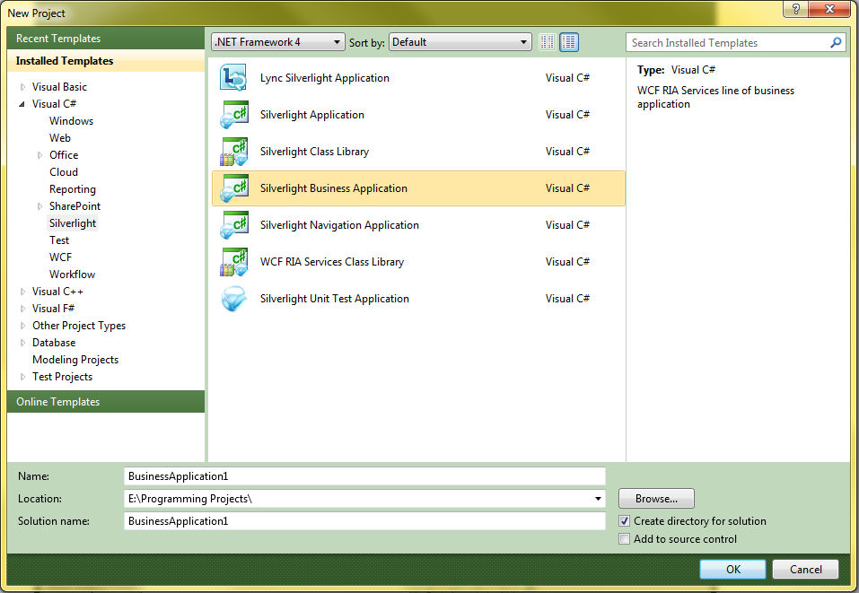

---
title: Silverlight Business Application Template
TOCTitle: Silverlight Business Application Template
ms:assetid: bbb3fdb6-f2f9-4625-8405-3db05077046b
ms:mtpsurl: https://msdn.microsoft.com/en-us/library/Hh180769(v=VS.91)
ms:contentKeyID: 35437169
ms.date: 08/19/2013
mtps_version: v=VS.91
---

# Silverlight Business Application Template

\[ **This document was written for WCF Services Version 1 Service Pack 2 and might not be up to date**  
Please see [Release Notes](https://github.com/OpenRIAServices/OpenRiaServices/releases) or [Changelog](https://github.com/OpenRIAServices/OpenRiaServices/blob/main/Changelog.md) for a list of changes since WCF RIA Services \]

Use the Silverlight Business Application template for projects that require user registration, authentication, roles and profiles, as well as integration and navigation between two or more web pages and localization.

## Silverlight Business Application Template

The Silverlight Business Application template builds on the Silverlight Navigation Application template, adding built in authentication services (with Forms Authentication for the authentication mode) user registration, and localization. It is the most fully featured and robust of the templates provided in the Silverlight SDK. It enables Open Ria Services automatically, providing a Open Ria Services link between the Silverlight client and server projects within the solution. The authentication services included in this template are designed to setup not only user identification for the developer, but also registration and management. Helper classes are added including DataFieldExtensions.cs, NotOperatorValueConverter.cs, and TargetNullValueConverter.cs. Also, the System.Windows.Controls.Data.DataForm.Toolkit library is included along with the RegistrationDataResources.resx and ValidationErrorResources.resx files. This template is the best starting place for writing a complex Open Ria Services business application that uses a Silverlight client.

For walkthroughs that use this complex template, see the [Walkthrough: Using the Silverlight Business Application Template](ee707360.md) and the [How to: Add Business Logic to the Domain Service](ee796240.md).

> [!IMPORTANT]
> The most recent Silverlight SDK and Open Ria Services Toolkit are required to use this template. For information on installing these prerequisites, see <A href="gg512106(v=vs.91).md">Prerequisites for Open Ria Services</A>.

### Deploying the Silverlight Business Application Template

### Creating a Open Ria Service Business Application

1.  Open Visual Studio.

2.  Click **File**, select **New**, and select **Project**. The following dialog box appears.
    
    

3.  Select Silverlight in the left pane, and then select **Silverlight Business Application** in the right pane. Click **OK**
    
    The following assemblies are referenced by this template by default.
    
    1.  mscorlib
    
    2.  System
    
    3.  System.ComponentModel.DataAnnotations
    
    4.  System.Core
    
    5.  System.Net
    
    6.  System.Runtime.Serialization
    
    7.  System.ServiceModel
    
    8.  OpenRiaServices.Client
    
    9.  OpenRiaServices.Client.Web
    
    10. System.ServiceModel.Web.Extensions
    
    11. System.Windows
    
    12. System.Windows.Browser
    
    13. System.Windows.Controls
    
    14. System.Windows.Controls.Data.DataForm.Toolkit
    
    15. System.Windows.Controls.Data.Input
    
    16. System.Windows.Controls.Navigation
    
    17. System.Xml

## See Also

#### Tasks

[Walkthrough: Using the Silverlight Business Application Template](ee707360.md)

#### Concepts

[Silverlight Application Template](hh180770.md)

[Silverlight Navigation Application Template](hh180767.md)

[Open Ria Services Class Library Template](hh180768.md)

