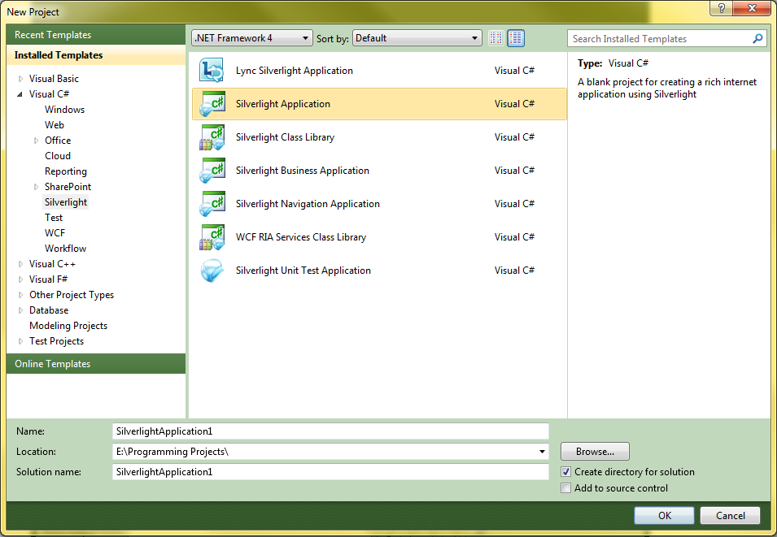
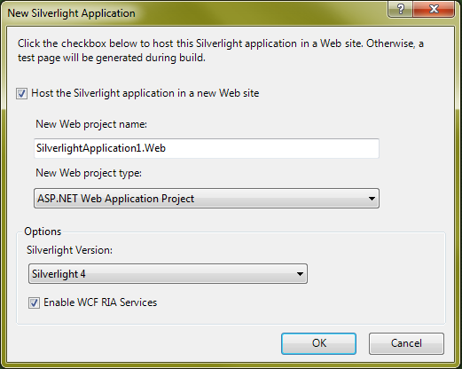

# Silverlight Application Template

\[ **This document was written for WCF Services Version 1 Service Pack 2 and might not be up to date**  
Please see [Release Notes](https://github.com/OpenRIAServices/OpenRiaServices/releases) or [Changelog](https://github.com/OpenRIAServices/OpenRiaServices/blob/main/Changelog.md) for a list of changes since WCF RIA Services \]

Use the Silverlight Application template for projects that require only a single Web page and do not require any authentication, or when you just want to design everything from the ground up.

## Silverlight Application Template

The Silverlight Application template is the most basic of the Silverlight templates. It contains only the bare minimum files in the Silverlight project and does not include any other features such as a navigation framework or authentication.

The other application templates extend this basic template. The Silverlight navigation Application template adds Frame and Page controls to enable integration and navigation between pages. The Silverlight Business Application template adds authentication, roles, and profiles to the Silverlight Navigation Application template, as well as localization. For more information about this template, see the [Silverlight Navigation Application Template](hh180767.md) and [Silverlight Business Application Template](hh180769.md) topics.

Enabling Open Ria Services with this template makes the Open Ria Services programming model available to the user and establishes a Open Ria Services link between the client and server projects within the Open Ria Services solution.


**Important:** The most recent Silverlight SDK and Open Ria Services Toolkit are required to use this template with Open Ria Services solutions. For information on installing these prerequisites, see <A href="gg512106(v=vs.91).md">Prerequisites for Open Ria Services</A>.


For walkthroughs that use this basic template, see the [Walkthrough: Using the Silverlight Business Application Template](ee707360.md) and the [How to: Add Business Logic to the Domain Service](ee796240.md).

## Deploying the Silverlight Application Template

### Creating a Open Ria Service Application

1.  Open Visual Studio.

2.  Click **File**, select **New**, and select **Project**. The following dialog box appears.
    
    

3.  Select Silverlight in the left pane, and then select **Silverlight Application** in the right pane. Click **OK**. The **New Silverlight Application** dialog box, shown below, appears.
    
    

4.  Check the **Host the Silverlight application in a new Web site** check box for the wizard to create a new ASP.NET project along with the Silverlight application.
    
    The **New web project type** dropdown gives three options for web application type, ASP.NET Web Application Project, ASP.NET Web Site, and ASP.NET MVC Web Project.
    
    The **Silverlight Version** dropdown gives the option of using Silverlight 3 or Silverlight 5.
    

    > [!IMPORTANT]
    > Open Ria Services requires Silverlight 5.

    
    The following assemblies are referenced by this template by default.
    
    1.  mscorlib
    
    2.  System
    
    3.  System.Core
    
    4.  System.Net
    
    5.  System.Windows
    
    6.  System.Windows.Browser
    
    7.  System.Xml

5.  Check **Enable Open Ria Services** on the **New Silverlight Application** dialog box to make the Open Ria Services programming model available to the user and establishes a Open Ria Services link between the client and server projects within the Open Ria Services solution.
    
    The following additional assemblies are referenced when you check the **Enable Open Ria Services** checkbox. They are required by the middle tier code that links the server and Silverlight client projects.
    
    1.  System.ComponentModel.DataAnnotations
    
    2.  System.Runtime.Serialization
    
    3.  System.ServiceModel
    
    4.  OpenRiaServices.Client
    
    5.  OpenRiaServices.Client.Web
    
    6.  System.ServiceModel.Web.Extensions

## See Also

#### Tasks

[Walkthrough: Creating a Open Ria Services Solution](ee707376.md)

#### Concepts

[Silverlight Navigation Application Template](hh180767.md)

[Silverlight Business Application Template](hh180769.md)

[Open Ria Services Class Library Template](hh180768.md)

