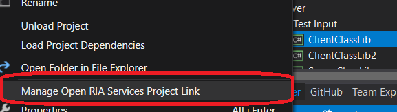
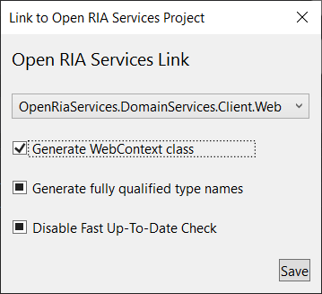

# Open Ria  Services Tooling 5.0

The Tooling provides templates for both items and projects using Open Ria Services as well as tooling support for configuring code generation options.
The Tooling is only for OpenRiaServices **5.0.0+**

Item Templates for "Domain Service" and "Authentication Service" for **C#** should work as expected.
Project Template "Open Ria Services Library" for **C#** should work, **other will probably give errors**

If you need support for previous versions (4.x) of OpenRiaServices you need to install an older version, 
or one of the older extensions on marketplace.

# Open Ria Services Project Link

Right click any project and choose *Manage Open Ria Services Project Link* to bring up a dialog
which hels you configure the code generation settings.
Use it to select which project contains your *DomainServices*.

Once selected you will be presented with the *Manage OpenRiaServices Project Link* Dialog which allows you to select your web project.

# Item Templates

## New DomainService

Allows you to scaffold an new DomainService with all CRUD methods for the entities you select.

## New AuthenticationService

Creates a new AuthenticationService for logging in using AspNetMembership authentication

# Project Templates
